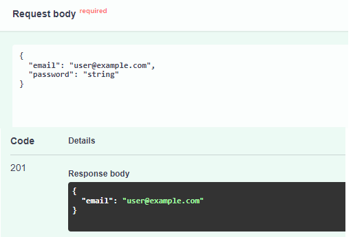
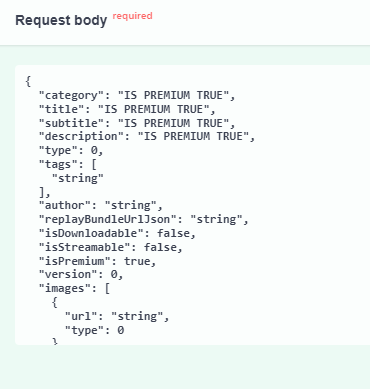
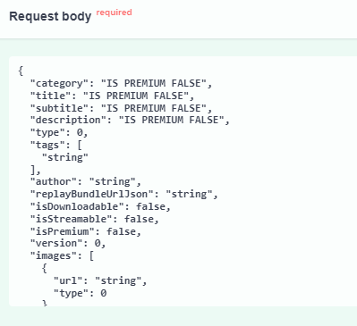
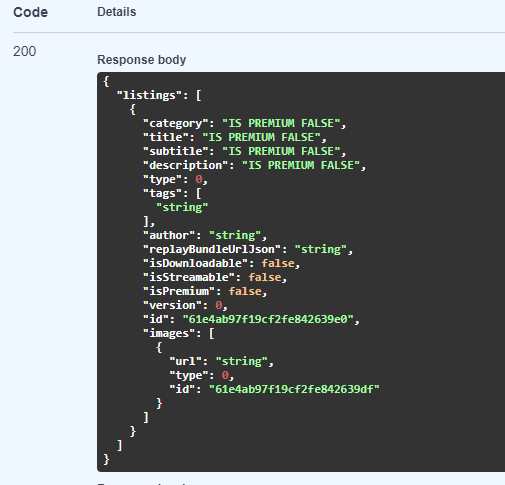
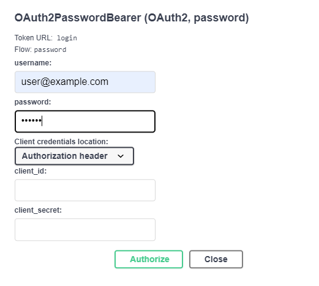
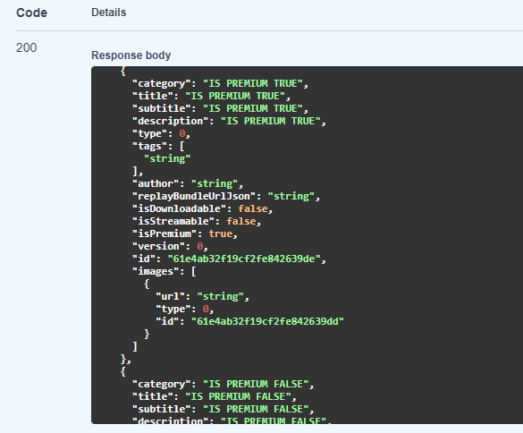
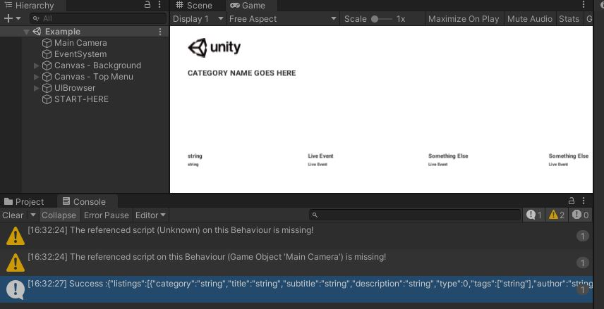

<!-- TABLE OF CONTENTS -->
## Table of Contents
  <ol>
    <li>
      <a href="#about-the-project">About The Project</a>
      <ul>
        <li><a href="#important-points-on-task">Important Points On Task</a></li>
      </ul>
      <ul>
        <li><a href="#project-structure">Project Structure</a></li>
      </ul>
      <ul>
        <li><a href="#architecture-and-design">Architecture and Design</a></li>
      </ul>
      <ul>
        <li><a href="#request-flow">Request Flow</a></li>
      </ul>
      <ul>
        <li><a href="#built-with">Built With</a></li>
      </ul>
    </li>
    <li>
      <a href="#getting-started">Getting Started</a>
      <ul>
        <li><a href="#prerequisites">Prerequisites</a></li>
        <li><a href="#installation">Installation</a></li>
      </ul>
    </li>
    <li><a href="#usage">Usage</a></li>
</ol>

## About The Project
<ul>
Sample API for unity interview process.

Tried implementing a self documenting code approach where all variables and function names are denoting what they are actually doing. 

API documentation can be accessed on `/docs` endpoint, when the project is up and running. 

For instructions on how to run the project navigate to <a href="#getting-started">Getting Started</a>

<li>

### Important Points On Task
<ol>

<li>
For the below objective. </br>

`Build a premium game listing feature that allows users from the Unity app to unlock premium game tiles.` 
</br>

I have implemented a basic authentication mechanism, where authentication would mean that a user has a premium subscription and can view premium listings. </br>
To segregate premium listings from normal ones I have added a new flag in json response `isPremium` which when set would mean that a listing is premium and only authenticated users can see these. </br> </br>

<ul>

 #### To Test Premium listings restriction follow the below steps.
<li>Create a user using ceate user API. </br>
</li>
<li>
  Add two listing one by `isPremium` flag and another with default `isPremium` value.
  
  
</li>
<li>
    Make the get request to listings api `/games` and see the response it will not show listing with `isPremium` true.
    </br>
    
    </br>
</li>
<li>
    Authorize using email id and pass of the user we created on above step.</br>
    
    </br>
</li>
<li>
    Again make the get request to listings api `/games` and see the response. Now we will be able to see 2 listings. One with `isPremium` set to true and another with `isPremium` set to false.
    </br>
    
</li>
</ul>
</br>
</li>
<li>
Git Commit Reference for integration of  [Unity App with Web API](https://github.com/ktandon91/unity_challenge/commit/265ec14ced41b1b7141d064a4ee14484f777ad9c)
</br>

</br>
</li>
<li>
Swagger Documention of the project can be found on root url or on `http://localhost:8000/docs` </br>
    >Note: Make sure project is up and running to view swagger documentation.
</li>
</ol>
</li>

<li>

### Project Structure
   
   ```
    ├───screenshots
    ├───src
    │   ├───api
    │   │   ├───fixtures
    │   │   ├───repository
    │   │   ├───routes   
    │   │   ├───schemas   
    │   │   ├───services   
    │   │   ├───oauth2.py
    │   │   ├───utils.py
    │   │   ├───config.py
    │   └───app.py
    ├───unityapp
    ├───docker-compose.yml
    ├───Dockerfile
    ├───README.md
    ├───requirements.txt
    ├───.env
   ```
</li>

<li>

### Architecture and Design

* Follows layered architecture approach
* Uses Repository design pattern. 
* Database design follows simple - [MongoDB embeded document design](https://docs.mongodb.com/manual/tutorial/model-embedded-one-to-many-relationships-between-documents/) 
  ```
    {
      "id": "string"
      "category": "string",
      "title": "string",
      "subtitle": "string",
      "description": "string",
      "type": int,
      "tags": [
        "string"
      ],
      "author": "string",
      "replayBundleUrlJson": "string",
      "isDownloadable": bool,
      "isStreamable": bool,
      "isPremium": bool,
      "version": int,
      "images": [
        { 
          "id": "string"
          "url": "string",
          "type": int
        }
      ]
    }
  ```

</li>
<li>

### Request Flow
  >* *app.py is the entry point of the application*
  >* *Request will first go to app.py*
  >* *From app.py, request will be forwarded to appropriate route handlers from routes directory*
  >* *Route handlers will validate the structure of the request using schema from schemas directory, and then from route handler appropriate service from services directory will be called*
  >* *Services will interact will the database and return the response to the route handlers*
</li>
</ul> 

<p align="right">(<a href="#top">back to top</a>)</p>

### Built With
Technologies used.

* [FastAPI](https://fastapi.tiangolo.com/)
* [Mongodb](https://www.mongodb.com/)
* [Docker](https://www.docker.com/)

<p align="right">(<a href="#top">back to top</a>)</p>

<!-- GETTING STARTED -->
## Getting Started

To get a local copy up and running follow these simple steps.

### Prerequisites

Make sure you have Docker installed on your system.

### Installation
1. Clone the repo
   ```sh
   git clone https://github.com/ktandon91/unity_challenge.git
   ```
   
2. Build and run docker images using below command.
   ```sh
   docker-compose build --up
   ```
   * Run the above command inside of project directory where `Dockerfile` and `docker-compose` file is residing.

3. Access the API on
   ```
   http://localhost:8000/
   ```

4. To load sample data `UITest.json`, make a simple get request to `/load`.  
    ```
    http://localhost:8000/load
    ```

<p align="right">(<a href="#top">back to top</a>)</p>

## Usage

All the APIs can be tested from swagger on below url.
   ```
   http://localhost:8000/docs
   ```
1. To get all the listings, make a get request on
    ```
    http://localhost:8000/api/games
    ```
    Resonse JSON 
    ```
      {
        "listings": [
          {
            "category": "string",
            "title": "string",
            "subtitle": "string",
            "description": "string",
            "type": 0,
            "tags": [
              "string"
            ],
            "author": "string",
            "replayBundleUrlJson": "string",
            "isDownloadable": false,
            "isStreamable": false,
            "isPremium": false,
            "version": 0,
            "id": "string",
            "images": [
              {
                "url": "string",
                "type": 0,
                "id": "string"
              }
            ]
          }
        ]
      }
    ```
2. To add a game listing, make a post request on
    ```
    http://localhost:8000/api/games
    ```
    Request JSON 
    ```
      {
        "category": "sample category",
        "title": "sample title",
        "subtitle": "sample subtitle",
        "description": "sample desc",
        "type": 0,
        "tags": [
          "tag 1"
        ],
        "author": "Dummy",
        "replayBundleUrlJson": "example.com/dummy.json",
        "isDownloadable": false,
        "isStreamable": false,
        "isPremium": false,
        "version": 0,
        "images": [
          {
            "url": "example.com/abc.jpeg",
            "type": 0
          }
        ]
      }

    ```
    Resonse
    ```
      Status Code: 201 Created
    ```
3. To view a single game listing, make a get request using game_id on.
    ```
    http://localhost:8000/api/games/{game_id}
    ```
    Resonse JSON 
    ```
      {
        "category": "sample category",
        "title": "sample title",
        "subtitle": "sample subtitle",
        "description": "sample desc",
        "type": 0,
        "tags": [
          "tag 1"
        ],
        "author": "Dummy",
        "replayBundleUrlJson": "example.com/dummy.json",
        "isDownloadable": false,
        "isStreamable": false,
        "isPremium": false,
        "version": 0,
        "id": "61e40b59bd01170bc41c32eb",
        "images": [
          {
            "url": "example.com/abc.jpeg",
            "type": 0,
            "id": "61e40b59bd01170bc41c32ea"
          }
        ]
      }
    ```    
4. To update a game listing, make a put request using game_id on.
    ```
    http://localhost:8000/api/games/{game_id}
    ```
    Request JSON 
    ```
    {
      "category": "sample category",
      "title": "sample title",
      "subtitle": "sample subtitle",
      "description": "sample desc",
      "type": 0,
      "tags": [
        "tag 1"
      ],
      "author": "Dummy",
      "replayBundleUrlJson": "example.com/dummy.json",
      "isDownloadable": false,
      "isStreamable": false,
      "isPremium": false,
      "version": 0,
      "id": "61e40b59bd01170bc41c32eb",
      "images": [
        {
          "url": "example.com/abc.jpeg",
          "type": 0,
          "id": "61e40b59bd01170bc41c32ea"
        }
      ]
    }
    ```
    Resonse
    ```
      Status Code: 200 OK
    ```    
5. To delete a game listing, make a delete using game_id request on.
    ```
    http://localhost:8000/api/games/{game_id}
    ```
    Resonse 
    ```
      Status Code: 204 No Content
    ```
6. To create a user, make a post request on.
    ```
    http://localhost:8000/api/users/
    ```
    Request JSON
    ```
      {
        "email": "user@example.com",
        "password": "string"
      }
    ```
7. To obtain a token to access token for premium listings, make a post requst on.
    ```
    http://localhost:8000/login
    ```
    Request 
    ```
        curl -X 'POST' \
          'http://localhost:8000/login' \
          -H 'accept: application/json' \
          -H 'Content-Type: application/x-www-form-urlencoded' \
          -d 'grant_type=&username=user%40example.com&password=string&scope=&client_id=&client_secret='
    ```
    Response 
    ```
      {
        "access_token":   "eyJhbGciOiJIUzI1NiIsInR5cCI6IkpXVCJ9.    eyJlbWFpbCI6InVzZXJAZXhhbXBsZS5jb20iLCJleHAiOjE2NDIzODE3Njd9.eOVNKAyuQ7nTpe5hROX_Uag9P9MF32xAiCPZr9_kfCA",
        "token_type": "bearer"
      }
    ```
